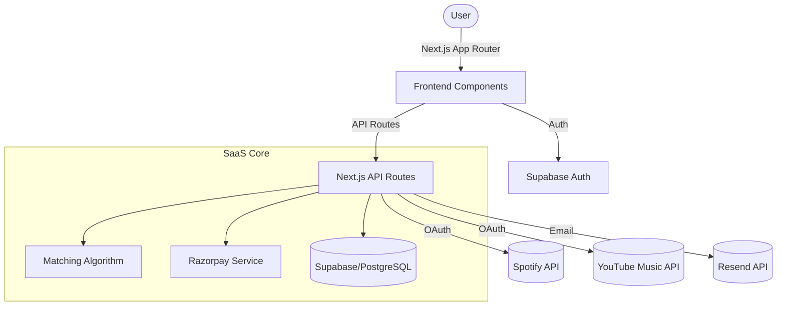

# 🎵 PlaySync SaaS

<div align="center">
  
  <p><em>The ultimate professional standard for seamless music library migration.</em></p>
  
  []()
  []()
  []()
  []()
</div>

---

## 🚀 Overview

**PlaySync** is a high-performance, full-stack SaaS application built to bridge the gap between music platforms. It allows users to migrate their expensive, curated playlists from **Spotify** to **YouTube Music** with extreme precision, bypassing standard API limitations with a custom intelligent matching engine.

### ✨ SaaS Features

- **💎 Glassmorphic Dashboard:** A premium, modern interface built with React 19 and Tailwind CSS v4.
- **🧠 AI-Powered Matching:** Utilizes advanced string-similarity and Levenshtein distance algorithms to ensure 99%+ match accuracy (studio versions vs live covers).
- **🔐 Enterprise Auth:** Secure, SSR-compatible session management powered by Supabase.
- **💳 Built-in Monetization:** Fully integrated Razorpay payment flow with custom subscription tiers (Free vs Pro).
- **� Real-time Progress:** WebSocket-ready architecture for tracking massive transfers in real-time.
- **� Automated Notifications:** Transactional email support via Resend integration.

---

## 🏗️ Technical Architecture



---

## 🛠️ Tech Stack

- **Framework:** [Next.js 16](https://nextjs.org/) (App Router)
- **Runtime:** [React 19](https://reactjs.org/)
- **Database:** [Supabase](https://supabase.com/) (Postgres)
- **Styling:** [Tailwind CSS v4](https://tailwindcss.com/), [Shadcn UI](https://ui.shadcn.com/)
- **Payments:** [Razorpay](https://razorpay.com/)
- **Email:** [Resend](https://resend.com/)
- **Validation:** [Zod](https://zod.dev/)

---

## 📋 Environment Configuration

To run this project, you will need to add the following variables to your `.env.local` file:

### Core Services
- `NEXT_PUBLIC_SUPABASE_URL`: Your Supabase Project URL
- `NEXT_PUBLIC_SUPABASE_ANON_KEY`: Your Supabase Anon Key
- `SUPABASE_SERVICE_ROLE_KEY`: For administrative database operations

### Payments (Razorpay)
- `RAZORPAY_KEY_ID`: Your Razorpay Key ID
- `RAZORPAY_KEY_SECRET`: Your Razorpay Key Secret

### Music Platforms
- `SPOTIFY_CLIENT_ID`: Spotify Developer App ID
- `SPOTIFY_CLIENT_SECRET`: Spotify Developer App Secret
- `YOUTUBE_API_KEY`: Google Cloud Console API Key

### Communication
- `RESEND_API_KEY`: Resend API Key for transactional emails

---

## 🏃 Local Setup

1. **Clone the repository:**
   ```bash
   git clone <your-repo-url>
   cd playlist-transfer
   ```

2. **Install dependencies:**
   ```bash
   npm install
   ```

3. **Configure Environment:**
   ```bash
   cp .env.example .env.local
   # Fill in your keys in .env.local
   ```

4. **Launch Development Server:**
   ```bash
   npm run dev
   ```

Open [http://localhost:3000](http://localhost:3000) to see your local instance.

---

## � Internal Structure

- `src/app`: App router containing landing, auth, and dashboard logic.
- `src/app/api`: Server-side routes for transfers, payments, and platform integrations.
- `src/components`: UI components powered by Shadcn and Radix.
- `src/lib`: Core services (Supabase client, Razorpay initialization, Matching logic).

---
<div align="center">
  Created for audiophiles, built by engineers.
</div>
